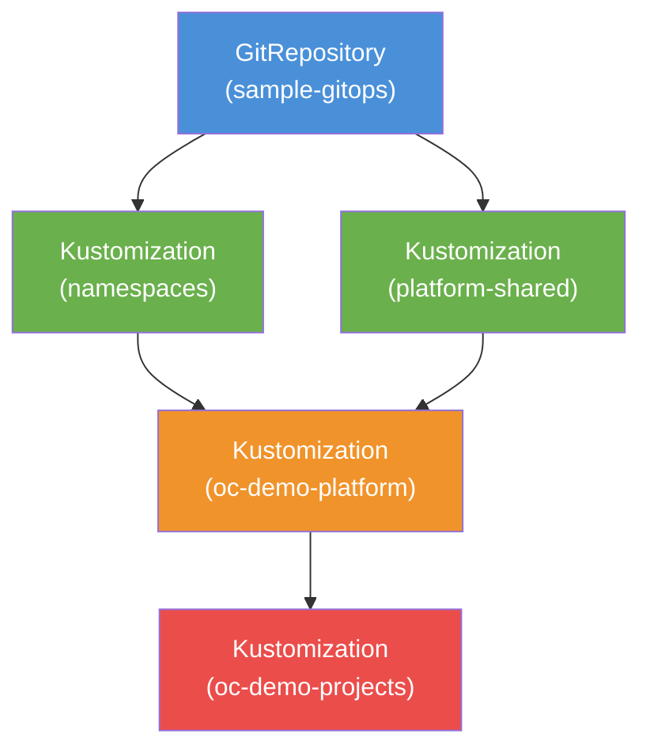

# GitOps with Flux CD

This tutorial walks through setting up a complete GitOps workflow using OpenChoreo and Flux CD with this sample-gitops repository. You will configure Flux for resource synchronization, build and deploy a multi-component application using OpenChoreo Workflows, and promote components across environments.

**Learning objectives:**

- Flux CD setup for OpenChoreo resource synchronization
- GitOps repository structure (platform vs. namespace organization)
- Secret synchronization with External Secrets Operator (ESO) and OpenBao
- Component building and deployment automation via OpenChoreo Workflows
- Distinguishing application source repositories from GitOps target repositories
- ComponentReleases and ReleaseBindings for environment promotion
- Development to staging pipeline execution (bulk component promotion)
- Diagnosing and troubleshooting workflow execution and secret sync issues

## Table of Contents

- [Prerequisites](#prerequisites)
- [Step 1: Fork and Clone the Sample Repository](#step-1-fork-and-clone-the-sample-repository)
- [Step 2: Update Repository URLs](#step-2-update-repository-urls)
- [Step 3: Create Git Secrets](#step-3-create-git-secrets)
- [Step 4: Deploy Flux Resources](#step-4-deploy-flux-resources)
- [Step 5: Verify Platform and Application Resources](#step-5-verify-platform-and-application-resources)
- [Step 6: Build and Deploy the Doclet Application](#step-6-build-and-deploy-the-doclet-application)
- [Step 7: Promote to Staging](#step-7-promote-to-staging)
- [Step 8: Environment-Specific Overrides](#step-8-environment-specific-overrides)
- [Troubleshooting & Diagnostics](#troubleshooting--diagnostics)
- [Clean Up](#clean-up)

---

## Prerequisites

### Understanding Repository Roles

In an OpenChoreo GitOps architecture, two distinct types of repositories are used:
- **Application Source Repository** (`https://github.com/openchoreo/sample-workloads.git`): Contains the application source code (e.g. Go backend services, React frontend, Dockerfiles). This is cloned during the workflow **build phase**.
- **GitOps Destination Repository** (`https://github.com/<your-github-username>/sample-gitops.git`): Contains the environment definitions, platform workflows, project components, and generated release manifests (`Workload`, `ComponentRelease`, `ReleaseBinding`). This is cloned and pushed to during the workflow **release phase** to open pull requests.

### Install OpenChoreo

Follow the official documentation: [Try it out on k3d locally](https://openchoreo.dev/docs/getting-started/try-it-out/on-k3d-locally/)

> [!WARNING]
> Do **not** install the OpenChoreo default resources. Only create the **default clusterdataplane** and **clusterworkflowplane**.

### Required Infrastructure Components

1. **Kubernetes Cluster & Tools:**
   - `kubectl` configured for cluster access
   - `git` CLI installed
   - A GitHub account for repository forking and PAT creation

2. **Flux CD:**
   - Flux CD requires `source-controller` and `kustomize-controller`. Follow the [official Flux installation guide](https://fluxcd.io/flux/installation/#dev-install), or run:
     ```bash
     kubectl apply -f https://github.com/fluxcd/flux2/releases/latest/download/install.yaml
     ```

3. **External Secrets Operator (ESO):**
   - ESO synchronizes secrets from OpenBao into Kubernetes Secrets for WorkflowRuns. Ensure ESO is installed and running:
     ```bash
     kubectl get pods -A | grep -i external-secrets
     ```

4. **OpenBao & ClusterSecretStore:**
   - A ready `ClusterSecretStore` named `default` referencing the OpenBao backend must exist in the cluster:
     ```bash
     kubectl get clustersecretstore default
     ```

> [!IMPORTANT]
> **Flux Authentication vs. Workflow Authentication:**
> Storing tokens in OpenBao configures credentials for OpenChoreo *WorkflowRuns*. If your GitOps repository fork is **private**, Flux's `source-controller` requires its own Kubernetes secret in the `flux-system` namespace. The OpenBao workflow tokens alone do not authenticate Flux. See the [Flux secret management guide](https://fluxcd.io/flux/cmd/flux_create_secret_git/).

---

## Step 1: Fork and Clone the Sample Repository

1. Navigate to the [sample-gitops](https://github.com/openchoreo/sample-gitops) GitHub repository.
2. Click **Fork** in the top-right corner.
3. Clone your forked repository locally:

```bash
git clone https://github.com/<your-github-username>/sample-gitops.git
cd sample-gitops
```

---

## Step 2: Update Repository URLs

Flux and OpenChoreo build-and-release workflows need to target your forked repository for GitOps operations while keeping application source code pointed to the workload repository.

### 2.1 Update the Flux GitRepository

Edit [`flux/gitrepository.yaml`](./gitrepository.yaml) and update the `spec.url` field to point to your fork:

```yaml
apiVersion: source.toolkit.fluxcd.io/v1
kind: GitRepository
metadata:
  name: sample-gitops
  namespace: flux-system
spec:
  interval: 1m
  url: https://github.com/<your-github-username>/sample-gitops
  ref:
    branch: main
```

Commit and push this change to your fork.

### 2.2 Repository URL Reference

Here is a summary of all repository URL locations across the tutorial:

| Manifest / Location | Parameter / Field | Repository Type | Purpose | Value |
|---|---|---|---|---|
| [`flux/gitrepository.yaml`](./gitrepository.yaml) | `spec.url` | GitOps Destination | Flux cluster state sync | `https://github.com/<your-github-username>/sample-gitops` |
| Component definitions ([`namespaces/default/projects/doclet/components/*/component.yaml`](../namespaces/default/projects/doclet/components/)) | `spec.workflow.parameters.gitopsRepoUrl` | GitOps Destination | GitOps repo target for component workflows | `https://github.com/<your-github-username>/sample-gitops` |
| Component definitions ([`namespaces/default/projects/doclet/components/*/component.yaml`](../namespaces/default/projects/doclet/components/)) | `spec.workflow.parameters.repository.url` | Application Source | Source code repository | `https://github.com/openchoreo/sample-workloads.git` |
| WorkflowRun manifests (Step 6) | `spec.workflow.parameters.gitopsRepoUrl` | GitOps Destination | Target repository for release PRs | `https://github.com/<your-github-username>/sample-gitops` |
| WorkflowRun manifests (Step 6) | `spec.workflow.parameters.repository.url` | Application Source | Source code to clone & build | `https://github.com/openchoreo/sample-workloads.git` |
| Promotion WorkflowRun (Step 7) | `spec.workflow.parameters.gitops.repositoryUrl` | GitOps Destination | Target repository for staging promotion PRs | `https://github.com/<your-github-username>/sample-gitops` |

> [!NOTE]
> Workflow CR definitions parameterize `gitopsRepoUrl` with a default of `https://github.com/openchoreo/sample-gitops` and `gitopsBranch` with a default of `main`. You pass `gitopsRepoUrl` explicitly in your `WorkflowRun` or Component definitions without modifying the base workflow templates.

### 2.3 Generate a GitHub PAT

Generate a [GitHub Personal Access Token (PAT)](https://docs.github.com/en/authentication/keeping-your-account-and-data-secure/managing-your-personal-access-tokens) with read/write permissions (`repo` scope) to your forked repository. This token will be used by workflows to clone your GitOps repo, create feature branches, and open pull requests.

---

## Step 3: Create Git Secrets

[OpenChoreo Workflows](../namespaces/default/platform/workflows/README.md) use External Secrets Operator (ESO) to fetch tokens from OpenBao:

- **`secret/git-token`**: Used to clone private application source repositories (optional for public repositories like `sample-workloads`).
- **`secret/gitops-token`**: Mandatory; used to clone the GitOps repository, push release branches, and create pull requests.

Store your GitHub PAT in OpenBao under the expected property key (`git-token`):

```bash
# Secret for cloning source repositories (can use PAT or placeholder for public repos)
kubectl exec -n openbao openbao-0 -- bao kv put secret/git-token git-token=<your_github_pat>

# Secret for pushing to and creating PRs in the GitOps repository (mandatory)
kubectl exec -n openbao openbao-0 -- bao kv put secret/gitops-token git-token=<your_github_pat>
```

Replace `<your_github_pat>` with your actual token.

> [!TIP]
> **Safe Secret Verification:**
> Verify that the secret was written without printing the token in logs:
> ```bash
> kubectl exec -n openbao openbao-0 -- bao kv get -format=json secret/gitops-token | grep -q '"git-token"' && echo "gitops-token stored successfully"
> ```

---

## Step 4: Deploy Flux Resources

Apply the Flux resources to start syncing this repository with your cluster:

```bash
kubectl apply -f flux/
```

This creates five resources:

| Resource | Purpose |
|---|---|
| **GitRepository** (`sample-gitops`) | Monitors the forked repository for changes |
| **Kustomization** (`namespaces`) | Syncs the `namespaces/` directory |
| **Kustomization** (`platform-shared`) | Syncs the `platform-shared/` directory |
| **Kustomization** (`oc-demo-platform`) | Syncs the `platform/` directory; depends on namespaces and platform-shared |
| **Kustomization** (`oc-demo-projects`) | Syncs the `projects/` directory; depends on oc-demo-platform |

Flux uses `dependsOn` to enforce the correct apply order:



Trigger an immediate sync if needed:

```bash
kubectl annotate gitrepository -n flux-system sample-gitops \
  reconcile.fluxcd.io/requestedAt="$(date +%s)" --overwrite
```

---

## Step 5: Verify Platform and Application Resources

Before triggering WorkflowRuns in Step 6, confirm that all prerequisites, Flux kustomizations, platform objects, and Doclet components are fully reconciled and ready.

### 5.1 Check Flux Sync Status

```bash
kubectl get gitrepository,kustomization -n flux-system
```

Ensure all Kustomizations (`namespaces`, `platform-shared`, `oc-demo-platform`, `oc-demo-projects`) show `Ready=True`.

### 5.2 Check Projects and Components

```bash
kubectl get projects,components -n default
```

You should see the `doclet` Project and its three Components: `document-svc`, `collab-svc`, and `frontend`.

> [!IMPORTANT]
> The `oc-demo-projects` Kustomization should normally create the Doclet Project and Components. Running `kubectl apply -R -f namespaces/default/projects/doclet/` manually is only a diagnostic workaround, not a substitute for repairing unhealthy Flux reconciliation.

### 5.3 Check Secret Infrastructure

Verify that ESO and `ClusterSecretStore` are healthy:

```bash
kubectl get pods -A | grep -i external-secrets
kubectl get clustersecretstore default
```

---

## Step 6: Build and Deploy the Doclet Application

The **Doclet** application is a multi-component system with two backend Go services and a React frontend. The `postgres` DB and `nats` broker are deployed as platform dependencies.

Trigger OpenChoreo WorkflowRuns to build the container images and create release pull requests against your forked GitOps repository.

### 6.1 Document Service

```bash
kubectl apply -f - <<EOF
apiVersion: openchoreo.dev/v1alpha1
kind: WorkflowRun
metadata:
  name: document-svc-manual-01
  namespace: default
  labels:
    openchoreo.dev/project: "doclet"
    openchoreo.dev/component: "document-svc"
spec:
  workflow:
    name: docker-gitops-release
    kind: Workflow
    parameters:
      componentName: document-svc
      projectName: doclet
      gitopsRepoUrl: https://github.com/<your-github-username>/sample-gitops
      gitopsBranch: main
      docker:
        context: /project-doclet-app/service-go-document
        filePath: /project-doclet-app/service-go-document/Dockerfile
      repository:
        appPath: /project-doclet-app/service-go-document
        revision:
          branch: main
          commit: ""
        url: https://github.com/openchoreo/sample-workloads.git
      workloadDescriptorPath: workload.yaml
EOF
```

### 6.2 Collaboration Service

```bash
kubectl apply -f - <<EOF
apiVersion: openchoreo.dev/v1alpha1
kind: WorkflowRun
metadata:
  name: collab-svc-manual-01
  namespace: default
  labels:
    openchoreo.dev/project: "doclet"
    openchoreo.dev/component: "collab-svc"
spec:
  workflow:
    kind: Workflow
    name: docker-gitops-release
    parameters:
      componentName: collab-svc
      projectName: doclet
      gitopsRepoUrl: https://github.com/<your-github-username>/sample-gitops
      gitopsBranch: main
      docker:
        context: /project-doclet-app/service-go-collab
        filePath: /project-doclet-app/service-go-collab/Dockerfile
      repository:
        appPath: /project-doclet-app/service-go-collab
        revision:
          branch: main
          commit: ""
        url: https://github.com/openchoreo/sample-workloads.git
      workloadDescriptorPath: workload.yaml
EOF
```

### 6.3 Frontend

```bash
kubectl apply -f - <<EOF
apiVersion: openchoreo.dev/v1alpha1
kind: WorkflowRun
metadata:
  name: frontend-workflow-manual-01
  namespace: default
  labels:
    openchoreo.dev/project: "doclet"
    openchoreo.dev/component: "frontend"
spec:
  workflow:
    kind: Workflow
    name: docker-gitops-release
    parameters:
      componentName: frontend
      projectName: doclet
      gitopsRepoUrl: https://github.com/<your-github-username>/sample-gitops
      gitopsBranch: main
      docker:
        context: /project-doclet-app/webapp-react-frontend
        filePath: /project-doclet-app/webapp-react-frontend/Dockerfile
      repository:
        appPath: /project-doclet-app/webapp-react-frontend
        revision:
          branch: main
          commit: ""
        url: https://github.com/openchoreo/sample-workloads.git
      workloadDescriptorPath: workload.yaml
EOF
```

> [!NOTE]
> Replace `<your-github-username>` in the `gitopsRepoUrl` parameter with your actual GitHub username. The application source code remains pointed at `openchoreo/sample-workloads`.

### 6.4 Workflow Execution Lifecycle

When a `WorkflowRun` is submitted:
1. OpenChoreo controller creates two `ExternalSecret` resources in the workflow namespace:
   - `<workflowrun-name>-source-git-secret` (from OpenBao `secret/git-token`)
   - `<workflowrun-name>-gitops-git-secret` (from OpenBao `secret/gitops-token`)
2. ESO fetches tokens from OpenBao via `ClusterSecretStore/default` and creates Kubernetes Secrets.
3. Argo Workflow runs the pipeline pods:
   - **`clone-source`**: Mounts optional source token; clones public `sample-workloads`.
   - **`build-image` & `push-image`**: Builds container image using Podman and pushes to the internal registry.
   - **`clone-gitops`**: Mounts mandatory `gitops-git-secret`; clones your fork.
   - **`generate-gitops-resources`**: Generates `Workload`, `ComponentRelease`, and `ReleaseBinding` manifests using `occ`.
   - **`git-commit-push-pr`**: Pushes a release branch to your fork and opens a Pull Request using `gh`.

### 6.5 Merge the Pull Requests

Once all three workflows complete, **3 pull requests** will be opened in your GitOps repository fork. Each PR adds the release manifests targeting the **development** environment.

Review and merge each PR on GitHub, then trigger or wait for Flux to reconcile.

### 6.6 Verify the Deployment

```bash
kubectl get releasebindings
kubectl get deployments -A
kubectl get pods -A
```

---

## Step 7: Promote to Staging

After validating in development, promote the entire **Doclet** project to staging using `bulk-gitops-release`:

```bash
kubectl apply -f - <<EOF
apiVersion: openchoreo.dev/v1alpha1
kind: WorkflowRun
metadata:
  name: bulk-release-manual-01
  namespace: default
spec:
  workflow:
    kind: Workflow
    name: bulk-gitops-release
    parameters:
      scope:
        all: false
        projectName: "doclet"
      gitops:
        repositoryUrl: "https://github.com/<your-github-username>/sample-gitops"
        branch: "main"
        targetEnvironment: "staging"
        deploymentPipeline: "standard"
EOF
```

Replace `<your-github-username>` with your GitHub username. Merge the resulting pull request and verify:

```bash
kubectl get releasebindings
```

---

## Step 8: Environment-Specific Overrides

In OpenChoreo, the **ReleaseBinding** defines environment-specific configuration overrides (e.g. database host, replica count, environment variables) while preserving immutable `ComponentRelease` artifacts across environments.

---

## Troubleshooting & Diagnostics

If a workflow run is pending, fails, or appears stuck during clone/checkout, follow this diagnostic sequence.

### Diagnostic Commands Reference

```bash
# 1. Check Flux reconciliation
kubectl get gitrepository,kustomization -n flux-system
kubectl describe gitrepository sample-gitops -n flux-system
kubectl describe kustomization oc-demo-projects -n flux-system

# 2. Check OpenChoreo Projects & Components
kubectl get projects,components -n default

# 3. Check External Secrets Operator & ClusterSecretStore
kubectl get pods -A | grep -i external-secrets
kubectl get clustersecretstore default
kubectl describe clustersecretstore default

# 4. Check ExternalSecrets generated for the WorkflowRun
kubectl get externalsecret -A
kubectl describe externalsecret <workflowrun-name>-source-git-secret -n default
kubectl describe externalsecret <workflowrun-name>-gitops-git-secret -n default

# 5. Check generated Kubernetes Secrets (safely verify without printing tokens)
kubectl get secret <workflowrun-name>-source-git-secret -n default
kubectl get secret <workflowrun-name>-gitops-git-secret -n default
kubectl get secret <workflowrun-name>-gitops-git-secret -n default -o jsonpath='{.data.git-token}' | base64 -d | wc -c

# 6. Check OpenChoreo WorkflowRun & Argo Workflow state
kubectl get workflowrun <workflowrun-name> -n default -o yaml
kubectl get workflows.argoproj.io -A

# 7. Check Workflow pods and logs
kubectl get pods -A
argo logs <workflow-name> -n <workflow-namespace> --follow
kubectl describe pod -n <workflow-namespace> <pod-name>
```

### Error-to-Cause Matrix

| Symptom / Error Message | Likely Root Cause | Resolution |
|---|---|---|
| Pod stuck in `ContainerCreating` or `FailedMount` for `<workflowrun>-gitops-git-secret` | ExternalSecret failed to synchronize secret from OpenBao. Either ESO is not running, `ClusterSecretStore/default` is not ready, or OpenBao is missing `secret/gitops-token`. | Verify ESO pods (`kubectl get pods -A \| grep -i external-secrets`), check `kubectl describe clustersecretstore default`, and ensure `secret/gitops-token` is populated in OpenBao with property `git-token`. |
| `clone-source` fails with HTTP 401/403 `Authentication failed` | Private source repository specified but `secret/git-token` contains an invalid PAT or lacks repo read permissions. | Update `secret/git-token` in OpenBao with a valid GitHub PAT having repository read access. |
| `clone-gitops` fails with HTTP 404 `Repository not found` | `gitopsRepoUrl` is pointing to the upstream repository or has a typo in the username/repository name. | Ensure `gitopsRepoUrl` in your `WorkflowRun` or `Component` manifest points to `https://github.com/<your-github-username>/sample-gitops`. |
| `clone-gitops` or `git-commit-push-pr` fails with HTTP 401/403 or `Permission denied` | `secret/gitops-token` PAT is expired, missing, or lacks write permissions (`repo` scope) to the forked GitOps repository. | Regenerate a GitHub PAT with `repo` read/write access and update OpenBao: `kubectl exec -n openbao openbao-0 -- bao kv put secret/gitops-token git-token=<pat>`. |
| `Could not resolve host: github.com` or network timeouts | Cluster DNS resolution or egress connectivity failure from workflow pods. | Check cluster CoreDNS pods (`kubectl get pods -n kube-system -l k8s-app=kube-dns`) and host network connectivity. |
| Flux `GitRepository` shows authentication error for private fork | Flux `source-controller` cannot authenticate to private repository. | Create a Flux Git secret in the `flux-system` namespace using `flux create secret git sample-gitops-auth --url=...` and link it in `flux/gitrepository.yaml`. |

---

## Clean Up

Remove the Flux resources to stop syncing:

```bash
kubectl delete -f flux/
```
